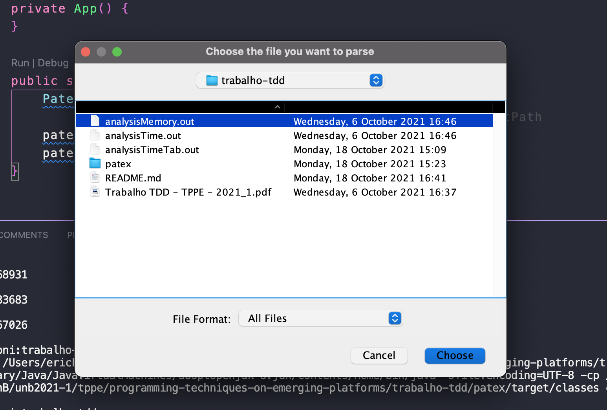
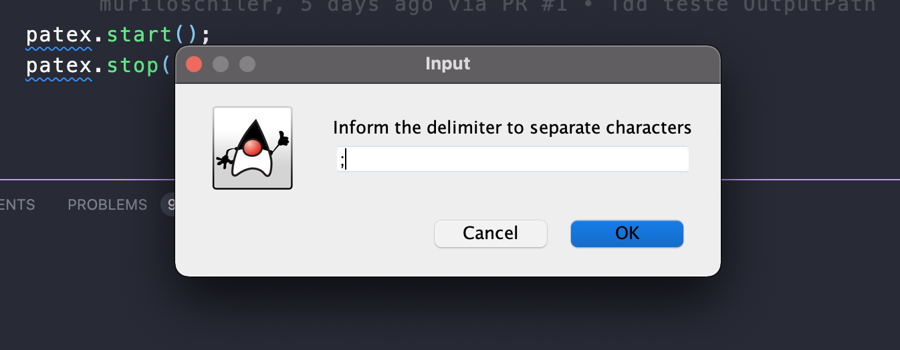
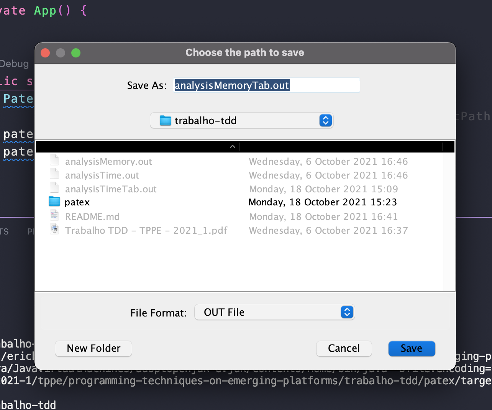
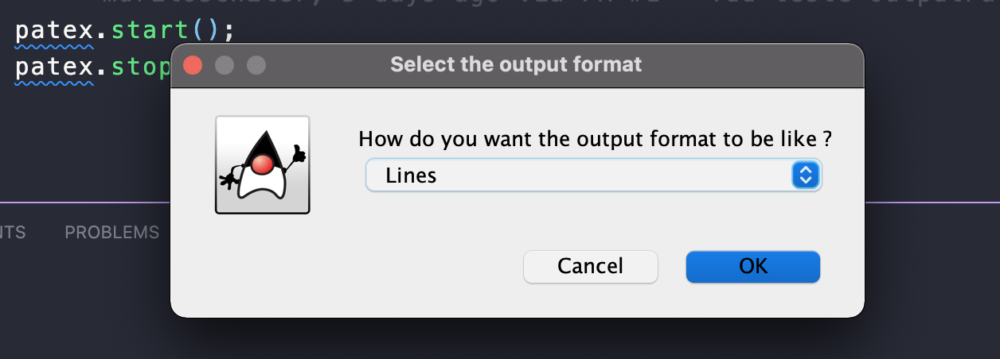
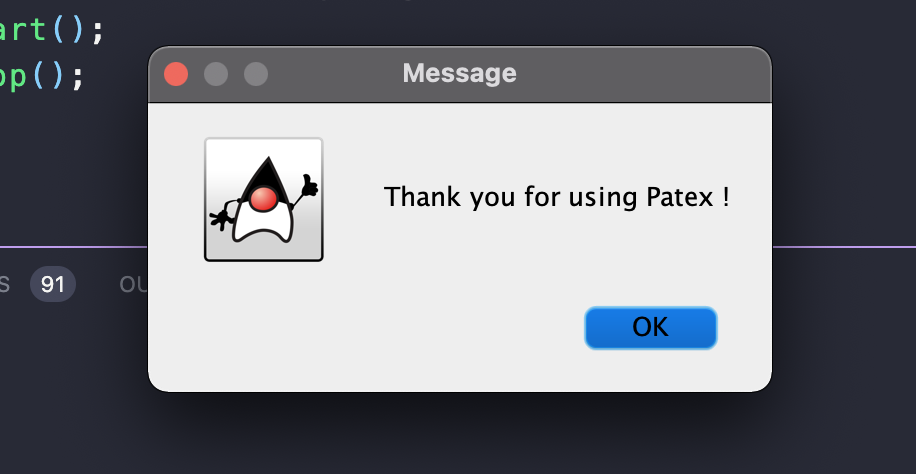

# Patex app

A aplicação **Patex** tem como objetivo fazer um *parse* de resultados de análises 
de confiabilidade em linhas de produto de *software*.

O ***pa**rser* de **tex**to (Patex) lê os valores anotados para cada evolução do 
software a partir de um arquivo de entrada. Então escreve num arquivo de saída os 
valores lidos, porém de modo formatado segundo um delimitador escolhido pelo usuário. 

Esse é o trabalho prático 1 da disciplina de Técnicas de Programação em Plataformas 
Emergentes, do curso de Engenharia de Software da Universdade de Brasília (UnB). 
O enunciado pode ser lido em "Trabalho TDD - TPPE - 2021_1.pdf". 

**Patex** foi desenvolvido seguindo o ***Test-Driven Development*** (TDD) e, em 
um segundo momento, essa aplicação foi melhorada a partir da metodologia de ***Refactoring***. 

O enunciado do momento de refatoração está em ["Trabalho-Refactoring-TPPE-2021_1.pdf"](./Trabalho-Refactoring-TPPE-2021_1.pdf). 
A metodologia utilizada para essa parte do trabalho se baseou na criação de *branches* 
para cada operação de refatoração, seguida da realização de *pull requests*. 
O planejamento disso está disponível na [***issue*** #4](https://github.com/ErickGiffoni/programming-techniques-on-emerging-platforms/issues/4)

**O grupo:**

- Erick Giffoni (170141161)
- Murilo Schiler (150142536)

**Screenshots:**

Tela inicial

Escolha do delimitador

Escolha do local de escrita do arquivo de saída

Escolha do formato de saída (linhas ou colunas)

Fim

## Referências

[1] LANNA, André L. P. M.. Aulas ministradas na disciplina de *Técnicas de* 
*Programação em Plataformas Emergentes*. Universidade de Brasília, 2021. 

[2] Refactoring Guru. *Extract Method*. Disponível em <https://refactoring.guru/extract-method>. 

[3] Refactoring Guru. *Replace Method with Method Object*. Disponível em <https://refactoring.guru/replace-method-with-method-object>. 

[4] Refactoring Guru. *Extract Class*. Disponível em <https://refactoring.guru/extract-class>. 